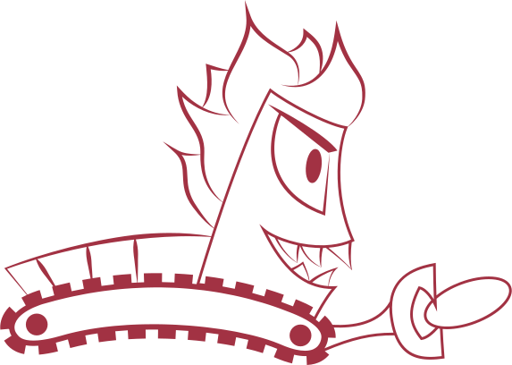

# Willkommen beim Ratrac Wiki

## Über uns

Ratrac oder auch einfach "*Rätu*" ist eine offene Gemeinschaft von Spielern, die sich leidenschaftlich für den Sport engagieren und "High Level Ultimate" spielen wollen.

## Warum dieses Wiki?

Wir haben dieses Wiki erstellt, um unser Wissen zu sammeln, zu organisieren und für alle Mitglieder zugänglich zu machen. Es dient nicht nur als Informationszentrale für unsere aktuellen Spieler, sondern auch als Archiv für vergangene Erfolge und eine Ressource für zukünftige Generationen von Ratrac-Spielern. Durch die Strukturierung unseres Wissens wollen wir unser Team auf ein neues Level heben und sicherstellen, dass wir auch in Zukunft Erfolge feiern können.

